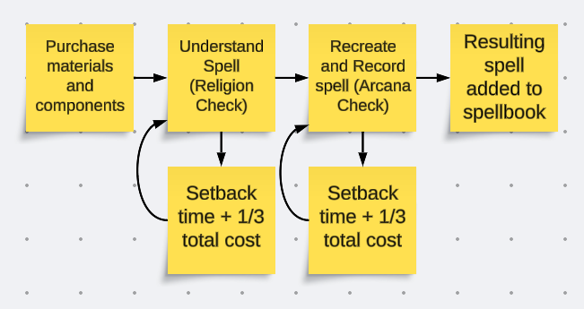

# Whatever would posess you to make this?

A little while ago, I approched the DM of one of my DnD games with the proposition for my musically and stabbily inclined Wizard to start learning Cleric and Paladin spells. Given that it made sense for my character, the only non-religious person in a party of Clerics and Paladins, to want to learn those spells (while also having enough hubris to refuse to worship a god to gain said spell knowledge), the DM agreed and worked out a system for my character to learn these spells. If you're familiar with DnD 5e's rules, you'll know that Wizarding is an expensive and massively time consuming endeavor. If you aren't familiar with DnD 5e's rules, Wizarding is an expensive and massively time consuming endeavor. Either way, all that cost for wizardry? Yeah, violating the laws of the universe to achieve divine power without the approval of the gods is *far* more expensive and time consuming. And difficult. And dangerous. But totally worth it if it works out.

Because it's so expensive and time consuming and has a chance of not even working on first attempt, I wanted to know how much gold and time I should be expecting to spend on this. Specifically (and here's our problem statement) **Given the base cost of an attempt to learn a Cleric or Paladin spell (both in gold pieces and days of work), the chances of succeeding on each of the checks required to learn the spell, and the additional costs incurred by subsequent attempts (also given in both gold pieces and days of work), how much money should I expect my character to spend on learning a spell.** Also, given that the costs are different depending on the level of the spell, but don't scale evenly, I wanted to know that information for all the different spell levels.

## So how is all of this working mechanically in game?

> **Heads Up**: If you don't understand DnD 5e, this next part probably isn't going to make sense. I recommend skipping ahead to [So how has calculating all this gone?](##so-how-has-calculating-all-this-gone?). If you do want to understand this part, it relies on the Basic Rules which you can find for free all over the web. D&D Beyond has them [here at this link](https://www.dndbeyond.com/sources/dnd/basic-rules-2014). Yes, the 2014 rules are what I'm operating on. It's the system I know and... use. It's a lot to read - it's basically a textbook - so I *really* don't recommend doing this unless you actually want to learn how to play DnD, and even then, YouTube videos will likely explain it all far better.

Let me introduce these handy dandy charts my DM gave me.

||Cantrip|Level 1|Level 2|Level 3|Level 4|Level 5|
|-|-|-|-|-|-|-|
|GP Cost|60|240|600|1200|3000|7200|
|Time|1 workweek*|1 workweek|2 workweeks|3 workweeks|5 workweeks|6 workweeks|
|Setback Time|1 day|2 days|1 workweek|1 workweek|2 workweeks|2 workweeks|
|Religion Check DC|18|18|18|20|20|20|
|Arcana Check DC|14|16|18|20|22|25|
|*A workweek is defined as 5 days of work.|

(Insert explanation of these charts here)

### How does your character stack up in all this?

Short answer: ok, but with a ton of room for improvement.

Long answer: my character, Caladon, is (at time of writing) a level 9 Wizard with an Intelligence score of 19, Wisdom of 11, Charisma of 12, and proficiency in Arcana. This means that he has a +4 to Religion checks and a +8 to Arcana checks. Not great, especially, for the Religion checks. And given the requirements to learn Cleric and Paladin spells of certain levels, he can't even learn that much. So uh... introducing the game plan for Caladon's advancement!

#### The Game Plan for Caladon's Advancement

There's only a couple of key levels here where there's actually choices to make and things to change, so I shall just explain those levels.

##### Level 12

The plan begins here at this level. DnD 5e players will be well aware that this is a level where you get choice of Ability Score Increase (ASI) or Feat (which is techinally an optional rule for those who didn't know). For those who aren't aware of what either of those things mean, go read the Basic Rules like I told you to. At this level, 

##### Table of all that stuff I just explained

[insert table of how things will add up here at the end]
|Character Level|Religion Bonus|Arcana Bonus|Max Level Cleric Spell|Max Level Paladin Spell|
|-|-|-|-|-|
|9|
|12|
|13|
|17|
|20|
## So how has calculating all this gone?

Uh... I mean it could have gone faster.

### Method One - AI can handle this, right?

On my first attempt to do all these calculations, I opted to give ChatGPT the problem statement and ask it for what the formula for such a calculation would look like. It gave me this:

$$Expected Cost = C_{i} + (\frac{P_{f}}{1 - P_{f}}) \times C_{f}$$

In this formula, the Expected Cost of a character attempting to learn a Cleric or Paladin spell is calculated based on three variables: the initial cost $C_{i}$, the cost of failure Cf, and the percent chance of failure Pf. Given that the process requires rolling two different times, I added an additional $(\frac{P_{f}}{1 - P_{f}}) \times C_{f}$ so the final formula for this method came out to be

$$Expected Cost = C_{i} + (\frac{P_{fr}}{1 - P_{fr}}) \times C_{f} + (\frac{P_{fa}}{1 - P_{fa}}) \times C_{f}$$

In this second formula, $P_{fr}$ represents the percentage chance of failure for the Religion check, and $P_{fa}$ represents the same but for Arcana. Now that I had this formula, all I had to do was plug it into a spreadsheet with my statistics and play around with some forumlas until I had a bunch of tables telling me not only how much an individual spell would cost at my current level, but also how much they cost cumulatively at future levels and a few steps in between those.

Using this method, I worked it out to be around 500,000GP and about 8 years to learn everything that Clerics and Paladins have but Wizards don't, and for the spells my character could actually learn, I calculated closer to 26,000GP and 1.25 years. This total assumes that I pick up all the spells of a given level between the first character level I can learn them and the last level that I have the same stats. Good thing this guy is an elf (though much of this may just be what he does after the adventures are over lol).

I was overall pretty satisfied with this answer as it gave me number, but...

### Method Two - Ay yo whaddup, Teach?

Given that I wasn't sure about the math of it (AI reliability in 2024, am I right?), I reached out to one of my old college profesors to ask him about the problem. Turns out my original method, courtesy of ChatGPT, was not great. The main problem he identified was that it wasn't going to properly handle repeated failures. 

## In Conculsion

Why did I do this? Because it was fun. Because it helped me sharpen skills I haven't used in a while. And because I care enough about this silly little roleplaying game to invest another nerdy skill of mine into enhancing my roleplay.

## Special Thanks

Thanks to my DM for working with me on this absurd, rule breaking project that gives my character something interesting to work on. This is probably the most Wizardy I've felt while playing a wizard in a long time, possibly ever. Hopefully the gods give me a couple warnings first.

Thank you also to my former professor [link to him here if i get permission/request to do so] for helping me figure out the math for this and giving me the prototype code for how to actually build the calculation. Couldn't have done it without the man willing to build a microprocessor simulator in Excel.
